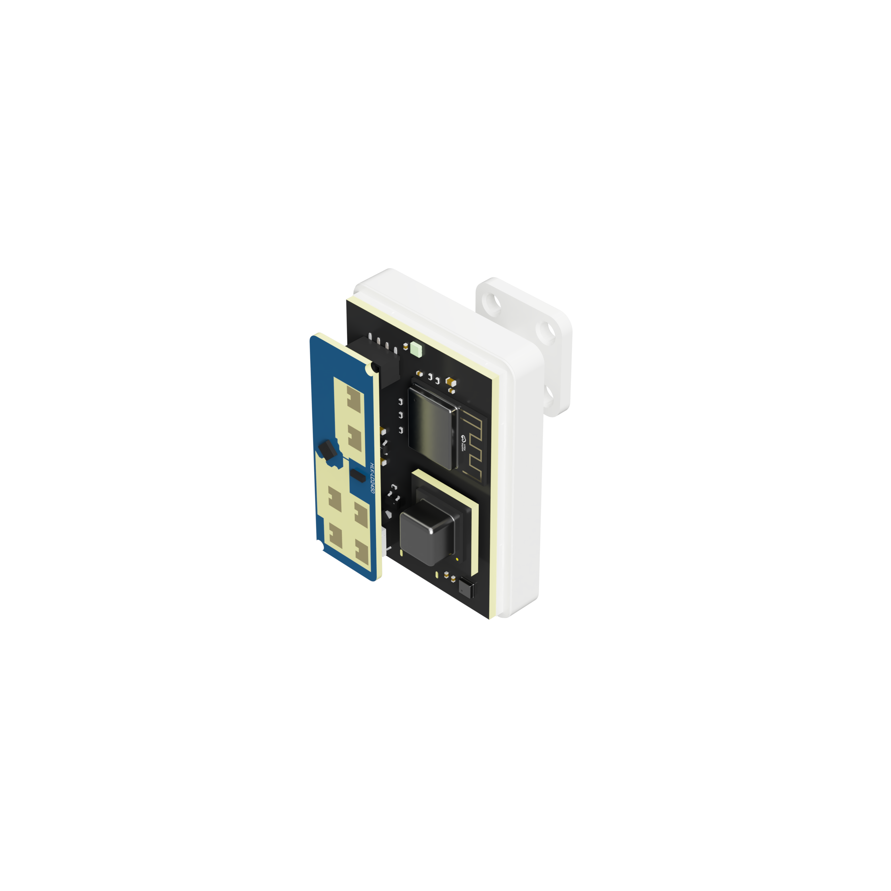

# Sensy-One S1 Pro Multi Sense (Zigbee)

The **S1 Pro Multi Sense (Zigbee)** is an all-in-one presence and indoor climate sensor made for Home Assistant.



It connects directly to your Zigbee network. There is no Wi-Fi setup, device IP address, cloud account, or ESPHome configuration.

## What the S1 Pro can do

- Track up to three people with the LD2450 mmWave radar
- Show target position, distance, and speed
- Detect presence and movement up to 6 metres
- Create three detection zones and one exclusion zone
- Measure temperature, humidity, air pressure, gas resistance, IAQ, equivalent CO2, and equivalent VOC with the BME688
- Measure ambient light and UV index with the LTR390
- Measure true CO2, temperature, and humidity with the optional SCD40 module
- Control the WS2812 RGB LED from Home Assistant
- Switch the MLT8530 buzzer on and off from Home Assistant

Radar information is updated every 0.5 seconds. Settings such as zones, offsets, radar options, LED state, and buzzer state are remembered after a restart.

The S1 Pro supports both **ZHA** and **Zigbee2MQTT** in Home Assistant. Choose one integration for your coordinator; ZHA and Zigbee2MQTT cannot use the same coordinator at the same time.

## Before you start

You need:

- Home Assistant
- A supported Zigbee coordinator assigned to either ZHA or Zigbee2MQTT
- The matching S1 Pro integration file from this repository
- A 5 V USB-C power supply

Devices supplied by Sensy-One already have the firmware installed.

## Option A: use ZHA

### A1. Install Zigbee Home Automation

Skip this step if ZHA is already working in Home Assistant.

1. Open **Settings → Devices & services**.
2. Select **Add integration**.
3. Search for **Zigbee Home Automation**.
4. Select your Zigbee coordinator and complete the setup.

More information is available in the [official Home Assistant ZHA guide](https://www.home-assistant.io/integrations/zha/).

### A2. Install the S1 Pro quirk

The quirk tells Home Assistant which sensors and controls the S1 Pro provides. Install it before pairing the device.

1. Download [`s1_pro_multi_sense_zigbee.py`](home_assistant/custom_zha_quirks/s1_pro_multi_sense_zigbee.py).
2. Create a folder named `custom_zha_quirks` in your Home Assistant configuration folder.
3. Place the downloaded file inside that folder.
4. Add this to `configuration.yaml`:

   ```yaml
   zha:
     custom_quirks_path: /config/custom_zha_quirks
   ```

5. Restart Home Assistant.

The complete path used by Home Assistant is:

```text
/config/custom_zha_quirks/s1_pro_multi_sense_zigbee.py
```

Home Assistant File Editor may show `/homeassistant` instead of `/config`. This is the same configuration folder.

If your `configuration.yaml` already has a `zha:` section, add only the `custom_quirks_path` line underneath it. Do not add a second `zha:` section.

### A3. Pair the S1 Pro with ZHA

1. Open **Settings → Devices & services → Zigbee Home Automation**.
2. Select **Add device**.
3. Connect the S1 Pro to USB-C power.
4. Wait for **S1 Pro Multi Sense xxxxxx** by **Sensy-One** to appear. The final six characters are the unique identifier of your device.

The LED breathes purple while the S1 Pro is looking for or reconnecting to a Zigbee network. After it connects, the LED returns to the colour and brightness selected in Home Assistant.

If the S1 Pro was previously connected to another Zigbee network, hold the physical **BOOT** button for at least five seconds and then try pairing again.

## Option B: use Zigbee2MQTT

### B1. Install Zigbee2MQTT

Skip this step if Zigbee2MQTT is already working in Home Assistant.

1. Install and configure an MQTT broker, such as the Mosquitto broker app.
2. Open **Settings → Apps → App store**.
3. Open the three-dot menu, select **Repositories**, and add the official app repository:

   ```text
   https://github.com/zigbee2mqtt/hassio-zigbee2mqtt
   ```

4. Install the stable **Zigbee2MQTT** app.
5. Select the serial port and adapter type for your coordinator, then complete Zigbee2MQTT onboarding.
6. Keep **Home Assistant integration** enabled in Zigbee2MQTT.

See the [official Zigbee2MQTT Home Assistant app guide](https://github.com/zigbee2mqtt/hassio-zigbee2mqtt) for coordinator-specific setup.

### B2. Install the S1 Pro external converter

Install the converter before pairing the S1 Pro.

1. Download [`s1_pro_multi_sense_zigbee.mjs`](home_assistant/zigbee2mqtt/s1_pro_multi_sense_zigbee.mjs).
2. Enable external JavaScript in the Zigbee2MQTT advanced settings. The equivalent `configuration.yaml` setting is:

   ```yaml
   advanced:
     enable_external_js: true
   ```

3. Create the Zigbee2MQTT `external_converters` folder and place the converter inside it. With the official Home Assistant app, the complete path is:

   ```text
   /config/zigbee2mqtt/external_converters/s1_pro_multi_sense_zigbee.mjs
   ```

4. Restart Zigbee2MQTT.
5. Open **Settings → Dev console → External converters** in Zigbee2MQTT and confirm that `s1_pro_multi_sense_zigbee.mjs` is loaded.

### B3. Pair the S1 Pro with Zigbee2MQTT

1. Open the Zigbee2MQTT frontend from Home Assistant.
2. Select **Permit join (All)**.
3. Connect the S1 Pro to USB-C power.
4. Wait for **S1 Pro Multi Sense (Zigbee)** by **Sensy-One** to finish its interview. Zigbee2MQTT should show the device as supported.

If the S1 Pro was previously connected to another Zigbee network, hold the physical **BOOT** button for at least five seconds while permit-join is active.

When migrating a coordinator from ZHA, first create a ZHA network backup, stop or disable ZHA, and only then start Zigbee2MQTT. Reset and pair the S1 Pro after Zigbee2MQTT and its external converter are running.

## Configure zones with the Home Assistant app

Use the official **Sensy-One Zone Editor** app to configure zones visually. You do not need to enter all polygon coordinates manually.

### Install the Zone Editor

1. Open **Settings → Apps → App store** in Home Assistant.
2. Open the three-dot menu and select **Repositories**.
3. Add this repository:

   ```text
   https://github.com/sensy-one/home-assistant-addons
   ```

4. Search for **Sensy-One Zone Editor**.
5. Select **Install** and then **Start**.
6. Optionally enable **Show in sidebar**.

### Create your zones

1. Open **Sensy-One Zone Editor** from Home Assistant.
2. Select your S1 Pro sensor.
3. Create or import your floorplan.
4. Place and rotate the sensor on the floorplan.
5. Draw Zone 1, Zone 2, Zone 3, or the Exclusion Zone.
6. Save the configuration.

The app also provides live target visualization, 2D and 3D views, and heatmap analysis. See the [Sensy-One Zone Editor repository](https://github.com/sensy-one/home-assistant-addons) for its complete guide.

Targets inside the Exclusion Zone are ignored. Their target data is set to zero, and they do not activate presence, movement, target count, or one of the three detection zones.

## Useful radar settings

The most important settings are available on the S1 Pro device page in Home Assistant:

- **Detection Range** limits how far the radar should detect targets.
- **Any Movement Threshold** determines how fast a target must move before movement is detected. The default is 15 cm/s.
- **Any Presence Delay** keeps presence active briefly after the last target disappears.
- **Radar Flip Y Axis** reverses the left and right target view for alternative mounting positions.
- **Radar Bluetooth** controls the Bluetooth function inside the LD2450. It is off by default.
- **Radar Single Target** switches the LD2450 between single-target and multi-target mode.

The presence delay only affects **Any Presence**. Target information and **All Targets Count** return to zero immediately when the target disappears.

## Air-quality sensors

### BME688

The built-in BME688 shows temperature, humidity, air pressure, gas resistance, IAQ, equivalent CO2, and equivalent VOC.

Equivalent CO2 and equivalent VOC are calculated air-quality estimates. They are not direct CO2 or VOC measurements. The IAQ sensor needs time to stabilize after first use or a factory reset.

Use **BME688 Temp Offset** in Home Assistant if you want to fine-tune the temperature reading.

### Optional SCD40

The optional SCD40 module measures true CO2, temperature, and humidity. If the module is not installed, its Home Assistant entities can remain unknown. This is normal.

For calibration:

1. Place the sensor in stable air with a known CO2 concentration.
2. Enter that value under **SCD40 Calibration Reference**.
3. Press **SCD40 Forced Calibration**.

The SCD40 also provides a temperature offset and factory-reset button.

## LED and buzzer

Use **WS2812 Led** in Home Assistant to select the LED colour, brightness, or power state.

When Zigbee is disconnected, the LED temporarily breathes purple. Your selected LED settings are not lost and return after Zigbee reconnects.

Use **MLT8530 Buzzer** to switch the buzzer on or off.

## Restart and reset

- **Radar Restart Module** restarts only the LD2450 radar.
- **Radar Factory Reset** resets the LD2450 settings.
- **SCD40 Factory Reset** resets the optional SCD40.
- **ESP32 Restart Module** restarts the complete S1 Pro.
- **ESP32 Factory Reset** erases the saved settings and Zigbee connection.
- Holding **BOOT** for five seconds clears the Zigbee connection so the device can be paired again.

After an ESP32 factory reset, pair the S1 Pro with Home Assistant again.

## Firmware update or recovery

The S1 Pro is delivered with firmware installed. USB flashing is only needed for an update or recovery.

The current firmware version is **v1.1.0**.

1. Download [`S1_Pro_Multi_Sense_Zigbee_v1.1.0_factory.bin`](firmware/S1_Pro_Multi_Sense_Zigbee_v1.1.0_factory.bin).
2. Open [ESPHome Web](https://web.esphome.io/) in Chrome or Edge on a desktop computer.
3. Connect the S1 Pro using a USB data cable and the bottom-facing USB-C port.
4. Select **Connect** and choose the S1 Pro serial port.
5. Select **Install** and choose the downloaded `factory.bin`.
6. Wait until flashing and verification are complete.

ESPHome Web is used only to install the firmware file. No ESPHome setup is needed.

If no serial port appears, check that the USB cable supports data. If necessary, hold **BOOT** while connecting the S1 Pro to enter download mode.

A factory installation can erase saved settings and the Zigbee connection. Pair and configure the S1 Pro again afterwards.

## Troubleshooting

### The S1 Pro is not discovered

- Make sure ZHA is searching for new devices or Zigbee2MQTT permit-join is active.
- Hold BOOT for at least five seconds and try again.
- Pair close to the Zigbee coordinator.

### Sensors or controls are missing

- With ZHA, check the quirk location and the `custom_quirks_path` setting.
- With Zigbee2MQTT, check that `enable_external_js` is enabled and the external converter is listed as loaded.
- Restart Home Assistant for ZHA or restart Zigbee2MQTT when using its external converter.
- If necessary, remove, reset, and pair the S1 Pro again.

### Zigbee2MQTT shows the device as unsupported

- Install the external converter before pairing.
- Confirm the converter filename ends in `.mjs`.
- Check the Zigbee2MQTT log for converter import errors.
- Re-interview the device after the converter is loaded.

### The coordinator cannot be opened

Make sure only one Zigbee integration is using it. Disable ZHA before starting Zigbee2MQTT, or stop Zigbee2MQTT before enabling ZHA.

### The LED keeps breathing purple

The S1 Pro is not connected to its Zigbee network. Check the coordinator and Zigbee range, or pair the device again.

### SCD40 values are unknown

This is expected when the optional SCD40 module is not installed.

## Support

- [GitHub Issues](https://github.com/sensy-one/S1-Pro-Multi-Sense-Zigbee/issues)
- [Sensy-One Discord](https://discord.gg/TB78Wprn66)
